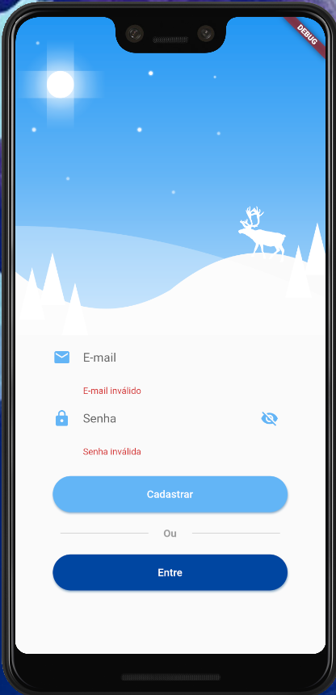

# Level Up #3 - Login

Terceiro desafio proposto pela Raro Academy.

## Getting Started

Level Up são desafios propostos pela Raro Academy para consolidar o conhecimento passado durante as aulas semanais da academia. Para o Level Up #3, foi solicitado que fizéssemos uma sistema de Login com validação de campos, algo que foi trabalhado durante durante algumas aulas da segunda semana da Raro Academy.

## Página de Login

As telas de login e cadastro atualmente estão bem bem semelhantes, tanto visualmente quanto nas suas lógicas de validação.

## Página de Cadastro

## To Do
- [ ] Criar página de "Esqueceu a senha?"
- [ ] Adicionar os elementos restantes da imagem superior

## Referência

- O layout teve como inspiração o template criado por [ruki](https://dribbble.com/weizhi) disponível no [Dribbble](https://dribbble.com/shots/2695917-Weather-Login-App/attachments/2695917-Weather-Login-App?mode=media).
